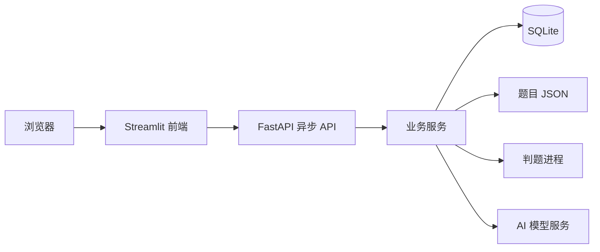

# 实验二：在线评测系统实验报告

> 姓名：张家睿　　学号：2025010428　　提交日期：2026-09-09

## 1. 实验目标

本实验实现一个可运行的 Online Judge（OJ）系统。系统以 FastAPI 提供异步 REST API，以 Streamlit 提供浏览器操作界面；完成题目管理、程序评测、用户与权限、评测记录、访问审计和 AI 辅助命题等功能，并保证接口响应、会话状态和权限控制一致。

## 2. 系统设计

系统采用“前端页面—API—业务服务—存储/执行器”的分层结构。Streamlit 只负责展示和调用 API；FastAPI 路由负责请求和响应；service 层实现业务规则；SQLite 保存用户、会话、语言、提交、日志和 AI 任务，题目按 JSON 文件分别保存在 `data/problems/`。

这样划分的优点是：前后端职责明确，权限判断集中在后端；题库数据符合实验要求的文件存储方式；判题和 AI 调用等耗时任务不会阻塞正常的 API 请求。

## 3. 功能实现

| 模块 | 实现说明 |
|---|---|
| 题目管理 | 支持题目列表、详情、新建、编辑和删除；题目包含样例、测试点、时间/内存限制及日志公开策略。 |
| 在线评测 | 支持 Python 3 与 C++14，并允许登录用户注册语言配置；评测分别处理编译错误、答案错误、运行错误、超时和内存超限。 |
| 提交管理 | 提交后立即返回 pending，后台逐测试点评测并记录分数、状态和编译信息；支持筛选、分页、查看详情和管理员重判。 |
| 用户与权限 | 支持注册、登录、登出、修改用户名、用户管理和角色控制；会话使用 HttpOnly Cookie，刷新及浏览器前后退后可恢复登录状态。 |
| 访问审计 | 记录允许及拒绝的敏感访问，列表显示用户名，管理员可在每条日志末尾删除记录。 |
| AI 命题 | 支持配置 OpenAI 兼容模型、创建任务、查看进度、中断、失败重试、费用与 Token 展示，以及基于生成结果继续对话修改。 |

### 3.1 判题与资源控制

提交代码在独立临时目录中编译和运行。系统按“题目限制—语言限制—系统默认值”的优先级确定资源限制，并结合 CPU 时间、墙钟时间、输出大小、进程数和进程树内存监控判断结果。超时、取消和正常结束都会回收进程组及临时目录，避免残留子进程影响后续评测。

输出比较忽略行尾空白和末尾空行。每个通过的测试点计 10 分；正常完成的评测即使答案错误也记为 `success`，只有编译或基础设施异常记为 `error`，从而能正确展示部分得分。

### 3.2 会话、路由与权限

登录成功后，后端签发不透明会话令牌并设置 HttpOnly Cookie；前端每次加载通过 `/api/auth/me` 校验会话。页面导航统一使用 Streamlit 的 `st.navigation`、`st.page_link` 和 `st.switch_page`，不再创建新浏览器标签或维护自定义历史记录，因此浏览器刷新、前进、后退和页面内返回均保持正确的单页体验。

权限判断在后端完成，普通用户不能修改或删除已有题目，管理员拥有题目管理、重判、用户管理和审计删除权限。接口在解析请求体前优先完成认证和角色检查，保证未登录、无权限与参数错误能返回正确的状态码。

### 3.3 AI 命题工作流

AI 配置中的密钥经 Fernet 加密保存，查询接口不返回密钥。创建任务时会固化该次使用的模型配置；后端在后台调用模型、校验其 JSON 输出并记录任务进度。前端提供极速、均衡和高质量三档模式：极速使用较快模型并关闭思考，均衡降低推理强度，高质量在初稿后额外核对答案、边界和复杂度。

生成结果可先审阅测试点和 JSON，再保存为题目；若“保存为新题目”的题号已存在，服务端会安全分配新的题号。对结果不满意时，用户可继续输入修改意见；每轮修改都生成一个新版本，并保留历史版本、用量和费用。失败任务可使用当前配置重新开始，原失败记录不会被覆盖。

## 4. 验证与结果

开发阶段使用隔离的临时数据库和题库进行 API、权限、判题和前端交互回归验证，覆盖 Python/C++ 编译执行、AC/WA/TLE/MLE/RE、分页筛选、重判、审计、会话恢复、AI 任务进度、取消、重试和费用计算等场景。另在浏览器中人工验证了登录、整页刷新、题目详情、AI 详情、浏览器返回、页面内返回和登出流程。

提交包仅保留系统运行所需代码、配置、题库、启动脚本和本报告；开发期自动化测试、压力数据生成脚本和缓存已清理，不影响使用 `./run.sh` 启动和演示系统。

## 5. 界面展示

提交前请将以下真实运行截图插入对应位置（截图中不要包含 API Key、Cookie 或个人敏感信息）：

1. 登录后题目列表及题目详情；
2. 提交代码后的评测结果（建议展示编译信息或部分得分）；
3. 管理员的访问审计页面；
4. AI 命题任务的进度或生成结果，以及继续修改后的版本。

## 6. AI 使用说明

本项目开发过程中使用 Codex 辅助进行代码阅读、问题定位、实现建议、回归检查和本报告初稿整理；功能设计、需求取舍、代码审阅和最终演示由本人确认完成。

> 提交前请按真实情况补充：本人实际投入时间为 `____` 小时；AI 辅助代码/文本的估计占比为 `____%`。该数值应如实填写，不应根据本报告猜测或虚构。

## 7. 总结

本实验完成了一个具备完整业务闭环的 OJ 系统。实现过程中最关键的体会是：判题状态、资源回收、会话恢复、权限边界和 AI 任务生命周期都属于跨模块问题，不能只依赖单一页面或单个接口验证。通过将耗时任务后台化、将权限集中到后端、将页面导航交给 Streamlit 原生机制，系统的稳定性和使用体验得到改善。
