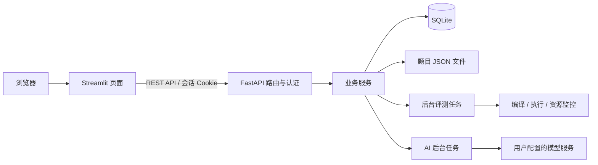

# 实验二：在线评测系统实验报告（初稿）

> 学生姓名、学号、总投入时间、AI 辅助比例、最终界面截图：请依据本人实际情况补充。本文技术部分依据当前代码与测试编写。

## 1. 系统功能与设计

系统使用 FastAPI 提供异步 REST API，Streamlit 提供操作页面。基础功能包括题目管理、Python/C++ 评测、动态语言注册、提交查询与重判、用户和角色管理、评测日志与访问审计。进阶模块支持 AI 辅助命题、模型配置、进度查询、中断及 Token 用量与费用展示。

代码按 routers、services、models/schemas 分层。SQLite 通过 SQLAlchemy 和 aiosqlite 访问；题目每题一个 JSON 文件，符合实验的文件存储设计。FastAPI 路由均为 async def，阻塞磁盘、密码哈希和进程操作通过线程执行，避免阻塞请求循环。

Streamlit 页面覆盖注册、登录/退出、用户名修改、个人信息、用户管理、动态语言注册、题目列表/详情/新增/编辑/删除、代码提交、评测记录和日志。页面统一调用后端 API，后端负责所有权限判断。浏览器 Cookie 支持刷新后恢复身份，`st.navigation` 原生路由支持浏览器前进和返回。

## 2. 关键实现与难点

### 2.1 判题状态和分数

提交立即返回 pending，后台按 language 字段读取数据库中的语言配置，准备带对应扩展名的源码，再执行编译与各测试点。内置 C++14 先编译再运行，Python 跳过编译；所有登录用户均可通过语言接口或前端页面注册新配置。输出比较忽略行尾空白和末尾空行；每个 AC 测试点计 10 分，counts 返回总分。

success 表示判题正常完成，允许有 WA/TLE/MLE/RE；error 表示编译或判题过程发生问题。用户已解决题目数按满分通过的不同题目数统计。这个区分使部分得分能正确显示，也避免把普通错误答案算作系统故障。

### 2.2 资源与任务清理

限制按题目显式值、语言配置、系统默认的顺序确定。程序在独立工作目录和进程组内运行，CPU、输出文件和进程数受 resource 限制，psutil 监测进程树内存，墙钟超时处理 sleep 等不消耗 CPU 的程序。

超时、中断和正常结束都清理进程组；输出使用有大小限制的临时文件，避免无限 stdout 消耗服务器内存。异步任务取消时通知执行线程并等待清理完成，再移除工作目录。该实现针对本地课程演示，没有容器级的文件与网络隔离。

重判等待旧任务终止，清空原分数与明细，再启动新代际；旧任务的回调只能移除自身。服务重启重新调度 pending 记录，并修复旧版错误的状态标记。

### 2.3 会话、权限和异常

随机令牌通过 HttpOnly Cookie 传递，服务端会话持久化并设置有效期，登出删除服务端会话。密码采用 bcrypt；超过 72 字节的密码先做 SHA-256 再 bcrypt，避免截断造成不同密码等价。

路由在解析 JSON 前检查身份和管理员权限，从而满足 401/403 优先于参数错误的约定。参数错误返回 400，所有响应包含与 HTTP 状态一致的 code。所有登录用户可创建和编辑题目、注册语言及使用 AI 命题；删除题目与修改日志公开策略仅管理员可操作。

评测明细按管理员、本人及题目公开策略裁剪。允许与拒绝的日志查询写入访问审计。删除题目不会抹掉历史评测；没有题目公开策略时默认关闭他人访问。

### 2.4 AI 命题工作流

用户配置服务 URL、模型、密钥及单价，密钥用 Fernet 加密保存，保存结果不回显密钥。创建任务时固定配置，避免运行期间变更配置影响该次调用。

后台调用模型、校验返回 JSON，再把结果保存在任务中。前端提供题面、样例、实际测试点和 JSON 编辑，用户审阅后通过原有题目 API 保存；改编保持原题 id。提示词要求覆盖知识点、边界和能区分算法复杂度的测试。

进度存入数据库，前端每 1.5 秒进行片段轮询，后端另提供 SSE；不同订阅者各自持有事件队列。中断会取消并等待后台任务结束。模型调用设总超时。

费用按输入/输出 Token 各自单价及计价单位计算，也可使用提供方直接返回的费用。重试累加每次用量；校验失败保留已发生的用量。缺失 Token 按包含系统提示词的字符数估算，并明确标注限制；未知价格不按零费用展示。

## 3. 成果展示与验证

运行方式为 `./run.sh`，前端默认地址 http://127.0.0.1:8501，初始管理员为课程指定账户。测试命令为 `.venv/bin/pytest -q`。

测试包含真实 Python/C++ 运行和编译，以及超时、内存超限、运行错误、错误答案、编译失败、未知可执行程序、重判清理、权限与分页、公开/非公开日志、AI 失败/重试/用量/中断、Streamlit 登录与题目审阅等场景。测试使用独立临时数据，AI 使用模拟模型接口。

完整回归 254 项通过。n=200000、q=50000 的构造数据中，Python 和 C++14 二分解法 AC，Python 线性扫描 TLE；三个随仓库发布的题目样例及测试点均经独立计算校验。详见 EXPERIMENT2_AUDIT.md。实际模型生成的题目正确性、边界数据和复杂度区分效果需另行验证。

待插入本人实际界面截图：题目详情与代码提交、部分得分与 C++ 编译信息、管理员日志公开设置、AI 运行中与中断状态、生成题目审阅与 Token 费用。

## 4. AI 使用说明

本次核对与修复使用 Codex 辅助阅读课程文档、审查已有代码、实现修复、编写回归测试和起草技术报告。工作流为：获取完整实验要求，逐模块对照代码，运行基线测试，补充原测试遗漏的边界用例，修正代码与错误预期，再做回归验证。

此前开发使用过的其他工具、人工与 AI 代码比例以及本人审阅方式，应根据真实开发过程补充，不能从当前仓库差异直接推算。

## 5. 总结与建议

本次检查表明，测试通过并不等于需求全部满足：如果测试把错误需求理解写成断言，仍会得出误导结论。较有效的方法是把状态语义、权限边界、取消后的资源释放和失败时的费用等跨模块行为直接写成回归用例。

后续可按需求加入隔离的判题运行环境、共享任务队列以及生成题目的标准解与数据校验工具。个人收获、开发时间分配和课程建议请由本人补充。
